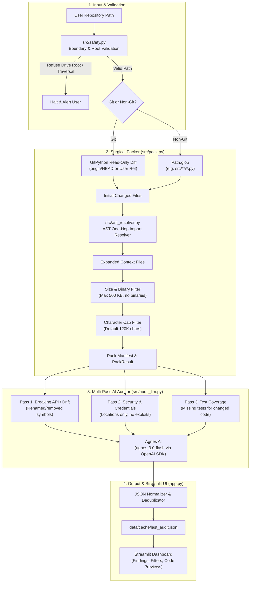

# Architecture

## Overview

Repo Auditor inspects changed files in a repository, resolves their immediate local Python dependencies using AST parsing, and limits the payload with a character cap before sending files to an LLM.



## Components

### Path safety (`src/safety.py`)

- Root drive checks: validates that the target path is not a drive root such as `D:\`, `C:\`, or `/`.
- Traversal checks: calls `is_safe_child_path` on each file using `Path.resolve().relative_to(root_path)` to catch symlink escapes or relative path tricks.
- Repository detection: checks for `.git` to pick between Git mode and glob mode.

### File packaging (`src/pack.py`)

- Git inspection: reads changed files against `origin/HEAD`, a user-supplied ref, or working tree diffs using GitPython. It never runs modifying Git commands.
- Non-git fallback: matches files with a user glob pattern such as `src/**/*.py` up to a configured file limit.
- Manifest generation: creates a table recording path, file size, inclusion status, and the reason for inclusion or exclusion.
- Character limit: stops packing when total characters reach the cap (default 120,000 characters).

### Import resolution (`src/ast_resolver.py`)

- Parses the Python AST of each candidate file to find `import` and `from ... import` statements.
- Resolves relative imports against the source file directory, and resolves package imports against the project root and `src/`.
- Includes one-hop local dependency files so the model sees caller and callee definitions without loading unrelated modules.

### Provider configuration (`src/providers.py`)

- Reads environment variables `AGNESAI_API_KEY`, `OPENAI_API_KEY`, and `GOOGLE_API_KEY` at startup.
- Defaults to Agnes AI (`agnes-3.0-flash` at `https://apihub.agnes-ai.com/v1`) using the official OpenAI Python SDK.
- Hides optional providers when their keys are missing.
- Checks whether keys exist without printing or logging their values.

### Audit passes (`src/audit_llm.py`)

The auditor runs three separate passes so each request has a single objective:

1. Pass 1 (Breaking API and call-site drift): finds mismatched signatures, renamed functions, or broken imports.
2. Pass 2 (Security and credentials): identifies injection vulnerabilities and exposed credentials. The prompt asks for line references only and forbids exploit generation.
3. Pass 3 (Test coverage): checks whether public functions or classes in changed files have corresponding unit tests.

Each pass produces findings in this JSON format:

```json
{
  "severity": "High | Medium | Low | Info",
  "file": "path/to/file",
  "title": "Short descriptive title",
  "evidence_span": "Exact lines or code snippet",
  "recommendation": "Remediation guidance"
}
```

Findings are stored in `data/cache/last_audit.json`.

### User interface (`app.py`)

Streamlit interface organized into four tabs:

- Select repo: path input, root validation, ref or glob configuration, and character cap slider.
- Pack: runs packaging, shows the manifest table, lists AST import links, and previews files.
- Audit: triggers the three passes with a progress bar and displays pass summaries.
- Findings: filters findings by severity and category, shows evidence snippets, and exports JSON.
