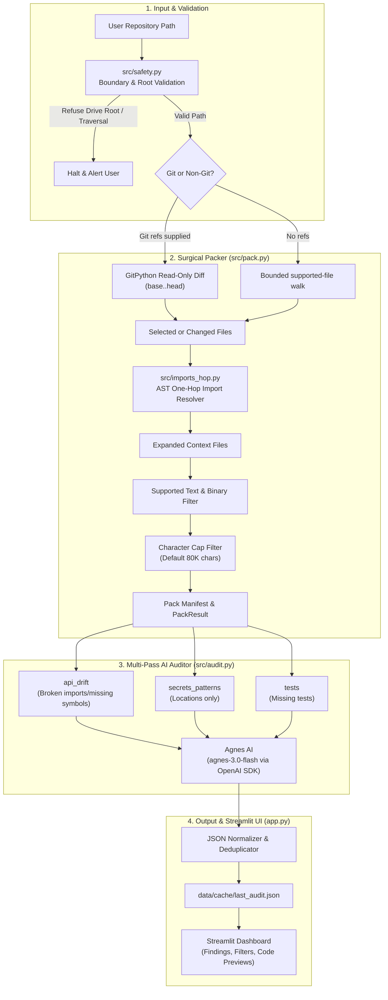

# Architecture

## Overview

Repo Auditor selects changed files from an optional Git diff or supported files from a bounded folder scan. It resolves immediate local Python dependencies with AST parsing and applies a character cap before sending the pack to an LLM.



## Components

### Path safety (`src/safety.py`)

- Root drive checks: validates that the target path is not a drive root such as `D:\`, `C:\`, or `/`.
- Path jail: resolves the typed root and every candidate before using `Path.relative_to()` to reject symlink escapes or paths outside that root.
- Repository detection: checks for `.git` to offer optional base/head diff fields; otherwise it uses the bounded folder scan.

### File packaging (`src/pack.py`)

- Git inspection: separate base/head UI fields feed a read-only `git diff --name-only base..head` through GitPython. A Git error is retained for display while selection falls back to the bounded folder walk.
- Default selection: walks `.py`, `.md`, `.txt`, and `.toml` files below the typed root up to configured caps.
- Manifest generation: creates a table recording path, file size, inclusion status, and the reason for inclusion or exclusion.
- Character limit: stops packing when total characters reach the cap (default 80,000 characters).
- Product boundary: Agnes receives only the generated pack. The application does not claim that the whole monorepo fits in context.

### Import resolution (`src/imports_hop.py`)

- Parses the Python AST of each candidate file to find `import` and `from ... import` statements.
- Resolves relative and same-folder imports while rejecting paths outside the selected root.
- Includes one-hop local dependency files so the model sees caller and callee definitions without loading unrelated modules.

### Provider configuration (`src/providers.py`)

- Reads only `AGNESAI_API_KEY` from the current process.
- Uses Agnes AI (`agnes-3.0-flash` at `https://apihub.agnes-ai.com/v1`) through the official OpenAI Python SDK.
- Checks whether keys exist without printing or logging their values.

### Audit passes (`src/audit.py`)

The auditor runs three separate passes so each request has a single objective:

1. `api_drift`: finds broken imports, renamed callees, and missing symbols.
2. `secrets_patterns`: finds hardcoded key-like assignments and `subprocess(..., shell=True)` locations.
3. `tests`: checks whether changed or public functions/classes have visible tests in the pack.

Every pass produces this JSON format:

```json
{
  "severity": "high | medium | low | info",
  "file": "path/to/file",
  "title": "Short descriptive title",
  "evidence_span": "Exact lines or code snippet",
  "pass_name": "api_drift | secrets_patterns | tests",
  "recommendation": "Remediation guidance or empty string"
}
```

Findings are stored in `data/cache/last_audit.json`.

Findings with the same `file + title` are deduplicated. Security output is reduced to categorical titles and location-only evidence with an empty recommendation; it cannot retain source snippets, secret values, exploits, or password-guessing recipes.

### User interface (`app.py`)

Streamlit interface organized into five pages:

- Health: reports whether `AGNESAI_API_KEY` is set without displaying its value.
- Select: path input, root validation, and optional Git base/head configuration.
- Pack: runs packaging, shows the manifest table, lists AST import links, and previews files.
- Audit: triggers the three passes with a progress bar and displays pass summaries.
- Findings: filters findings by severity and category, shows evidence snippets, and exports JSON.
